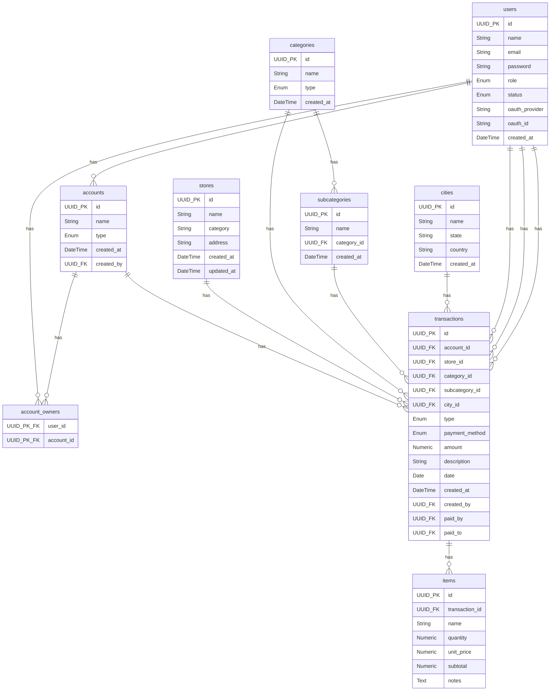

# Mermaid: Database schema

```mermaid
erDiagram
    categories {
        UUID_PK id
        String name
        Enum type
        DateTime created_at
    }

    cities {
        UUID_PK id
        String name
        String state
        String country
        DateTime created_at
    }

    stores {
        UUID_PK id
        String name
        String category
        String address
        DateTime created_at
        DateTime updated_at
    }

    users {
        UUID_PK id
        String name
        String email
        String password
        Enum role
        Enum status
        String oauth_provider
        String oauth_id
        DateTime created_at
    }

    accounts {
        UUID_PK id
        String name
        Enum type
        DateTime created_at
        UUID_FK created_by
    }

    subcategories {
        UUID_PK id
        String name
        UUID_FK category_id
        DateTime created_at
    }

    account_owners {
        UUID_PK_FK user_id
        UUID_PK_FK account_id
    }

    transactions {
        UUID_PK id
        UUID_FK account_id
        UUID_FK store_id
        UUID_FK category_id
        UUID_FK subcategory_id
        UUID_FK city_id
        Enum type
        Enum payment_method
        Numeric amount
        String description
        Date date
        DateTime created_at
        UUID_FK created_by
        UUID_FK paid_by
        UUID_FK paid_to
    }

    items {
        UUID_PK id
        UUID_FK transaction_id
        String name
        Numeric quantity
        Numeric unit_price
        Numeric subtotal
        Text notes
    }

    users ||--o{ accounts : has
    categories ||--o{ subcategories : has
    users ||--o{ account_owners : has
    accounts ||--o{ account_owners : has
    accounts ||--o{ transactions : has
    stores ||--o{ transactions : has
    categories ||--o{ transactions : has
    subcategories ||--o{ transactions : has
    cities ||--o{ transactions : has
    users ||--o{ transactions : has
    users ||--o{ transactions : has
    users ||--o{ transactions : has
    transactions ||--o{ items : has
```
